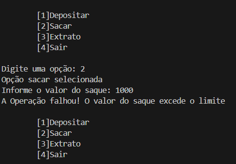

# DESAFIO CRIANDO UM SISTEMA BANCÁRIO COM PYTHON

**No Bootcamp da NTT DATA com a DIO, o primeiro desafio criado foi para desenvolver um sistema bancário com Python.**

## 🚩 Descrição do Desafio

> "Desenvovler um sistema, implementando 3 operações: depósito, saque e extrato."

## 🏴󠁧󠁢󠁥󠁮󠁧󠁿 Funcionalidades do Sistema:
- Trabalha apenas com um usuário
- Todos depositos devem ser armazenados uma variável e exibidos na operação de extrato
- Deve permitir realizar 3 saques com limite de R$ 500,00 por saque
- Deve exibir mensagem, caso não tenha saldo
- Todos os saques devem ser armazenados em uma variável e exibidos na operação de extrato
- A operação de extrato deve listar todos os depositos e saques realizados na conta"

